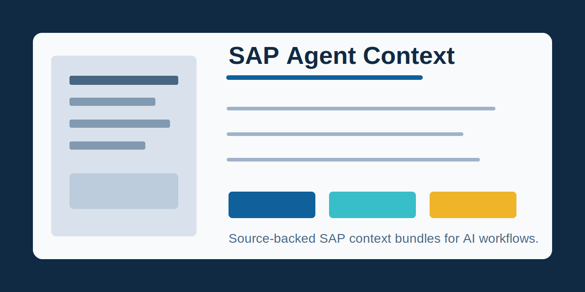

# SAP Agent Context

SAP Agent Context is a curated, link-first context layer for AI agents working
with SAP functional design, field mapping, workflow, roles, scope items, and
implementation support. It publishes compact JSONL agent records, source
pointers, freshness metadata, bundle quality gates, and deterministic evaluation fixtures
for SAP S/4HANA Cloud Public Edition work.

The repository does not mirror SAP Help, SAP Notes, Learning Hub, SAP for Me, or
customer content. It keeps reusable, agent-friendly metadata and cites external
sources through access-labelled pointers.



## Highlights

- Canonical JSONL agent records under `records/*.jsonl`.
- Canonical context layout documented in
  [Context Structure](docs/context-structure.md).
- Rebuildable SQLite, FTS5, JSONL, and vector-ready indexes under `build/`.
- Context bundle generation through the `sap-agent-context` CLI.
- Completeness, evidence integrity, retrieval precision, and FO-output
  evaluation gates.
- Typed context bundle contract for downstream consumers such as McCoy FO
  Generator v2 and local AI agent workflows.
- Public/gated/internal source labels, review dates, and expiration dates to
  prevent stale, expired, or private evidence from becoming hidden assumptions.

## Installation

Install `uv` and clone the repository:

```bash
git clone https://github.com/viggomeesters/sap-agent-context.git
cd sap-agent-context
uv sync
```

For local development without a remote, use the same commands from the repository
root after checking out this folder.

## Usage

Validate the context repository:

```bash
uv run sap-agent-context validate
uv run sap-agent-context audit-completeness
uv run sap-agent-context evaluate-fixtures
```

Synchronize legacy authoring files into agent-first JSONL records:

```bash
uv run sap-agent-context export-jsonl --output-dir records
```

The repo is JSONL-first and records-first: `records/*.jsonl` is the canonical agent record
surface. YAML is a legacy authoring/import format kept temporarily for human
pack editing; it is not the source of truth. The export writes typed JSONL files
for apps, tables, fields, workflows, roles, claims, sources, and relations, then
validates them against `schema/*.schema.json`. The intentional
JSONL-vault-spike alignment and compatibility deviations are documented in
[JSONL record surface](docs/jsonl-record-surface.md).

Build runtime indexes:

```bash
uv run sap-agent-context build-index
uv run sap-agent-context build-embeddings
uv run sap-agent-context evaluate-runtime-retrieval
uv run sap-agent-context evaluate-semantic-models
uv run sap-agent-context runtime-search "IE03 equipment display" --kind sap_app --vector --limit 5
```

Runtime artifacts under `build/` are generated from canonical `records/*.jsonl`.
SQLite + FTS5 is the primary local agent runtime; sqlite-vec is optional and
local-only. DuckDB is an optional analytics/coverage companion, not the primary
runtime store. See [Local runtime index](docs/local-runtime-index.md).

Generate a context bundle:

```bash
uv run sap-agent-context query \
  --intent fo.workflow \
  --topic "supplier-invoice workflow" \
  --sap-product s4hana_cloud_public \
  --limit 12 \
  --output build/context-bundles/supplier-invoice-workflow.json
```

Create a McCoy local-folder provider manifest:

```bash
uv run sap-agent-context mccoy-provider \
  build/context-bundles/supplier-invoice-workflow.json \
  --title "SAP Agent Context bundle - supplier-invoice workflow" \
  --output build/context-bundles/mccoy-provider.json
```

## Agent Setup

For local AI workflows, each colleague can clone the repository and register the
generated bundle directory with their agent or source-provider layer:

```bash
git clone https://github.com/viggomeesters/sap-agent-context.git sap-agent-context
cd sap-agent-context
uv sync
uv run sap-agent-context query \
  --intent fo.workflow \
  --topic "supplier-invoice workflow" \
  --sap-product s4hana_cloud_public \
  --limit 12 \
  --output build/context-bundles/supplier-invoice-workflow.json
```

The generated bundle includes `producer.name: sap-agent-context` and
`producer.contract: sap-agent-context-bundle`. The legacy
`bundle_kind: sap_fo_context_bundle` remains for backward-compatible consumers.

Representative no-gap queries:

```bash
uv run sap-agent-context query --intent fo.workflow --topic "supplier-invoice workflow" --sap-product s4hana_cloud_public --limit 12
uv run sap-agent-context query --intent fo.sap_configuration --topic "procurement purchase requisition workflow" --sap-product s4hana_cloud_public --limit 12
uv run sap-agent-context query --intent fo.field_mapping --topic "business partner master data" --sap-product s4hana_cloud_public --limit 12
uv run sap-agent-context query --intent fo.test_scenarios --topic "sales order output management" --sap-product s4hana_cloud_public --limit 12
uv run sap-agent-context query --intent fo.authorization --topic "integration communication role authorization api" --sap-product s4hana_cloud_public --limit 12
```

## Completeness Scope

The current product-grade scope is `sap_fo_starter_coverage`, defined in
`schema/completeness-matrix.yaml`.

It covers starter Functional Design knowledge for finance/AP, procurement,
sales, master data, migration, workflow, output management, authorizations,
integrations, extensibility, and analytics/reporting. The scope is intentionally
bounded: it is not exhaustive SAP product coverage. It is complete when
`sap-agent-context audit-completeness` reports zero critical and zero important
gaps.

Representative bundles are also checked against the
[Bundle Quality Contract](docs/bundle-quality-contract.md), so completeness is
not only item-count and knowledge-kind coverage.

For repeatable domain-density work, use the
[Deep domain pack template](docs/deep-domain-pack-template.md) and
`examples/deep-domain-pack-template.yaml`. The template is derived from the
completed EAM/PM lifecycle slice and defines the required source references, FO
patterns, decision rules, tests, fixtures, and bounded thresholds for a named
slice without claiming exhaustive SAP coverage.

## Development

Run the full local quality gate:

```bash
uv run sap-agent-context validate
uv run sap-agent-context audit-completeness
uv run sap-agent-context evaluate-fixtures
uv run sap-agent-context build-index
uv run sap-agent-context build-embeddings
uv run sap-agent-context evaluate-runtime-retrieval
uv run sap-agent-context evaluate-semantic-models
uv run pytest -q
uv run ruff check .
```

The CI workflow runs the same core validation commands on pushes and pull
requests.

## McCoy Integration

`mccoy-fo-generator-v2` can register generated bundle directories as local
source providers:

```bash
cd /path/to/mccoy-fo-generator-v2
uv run fo-gen-v2 register-source <workspace> <project-id> \
  --type local-folder \
  --title "SAP Agent Context bundle - supplier-invoice workflow" \
  --path "/path/to/sap-agent-context/build/context-bundles" \
  --provenance sap-agent-context
```

Typed consumers should use the
[Agent Consumer Contract](docs/agent-consumer-contract.md). McCoy-specific
local-folder registration remains an example integration path in
[McCoy FO Generator v2 Hook Contract](docs/mccoy-fo-generator-v2-hook.md).

## Privacy And Security

This repository is designed for public release. It stores generic SAP context,
Functional Design patterns, field mapping context, and source pointers, not
customer-specific evidence. Do not add tenant exports, client screenshots, SAP
Notes content, credentials, `.env` files, private keys, personal data, or
proprietary customer material.

The `supplier-invoice` filenames are generic SAP process examples, not customer
or private invoice records. See `docs/public-readiness.md` for the current
publication checklist and privacy review notes.

Report security issues privately according to [SECURITY.md](SECURITY.md).

## Release

This Python package is source-first. Public releases should be created as GitHub
tags/releases after the quality gate passes.

## Remote Strategy

Canonical public repository:

```text
https://github.com/viggomeesters/sap-agent-context
```

Recommended GitHub metadata:

- Description: `Source-backed SAP context bundles for AI agents, functional design, and field mapping.`
- Topics: `sap`, `s4hana`, `ai-agents`, `functional-design`, `field-mapping`, `knowledge-base`

## License

MIT License. See [LICENSE](LICENSE).


## SAP GUI EAM/PM examples

- [SAP GUI EAM/PM clone-first queries](examples/sap-gui-eam-pm-queries.md)
